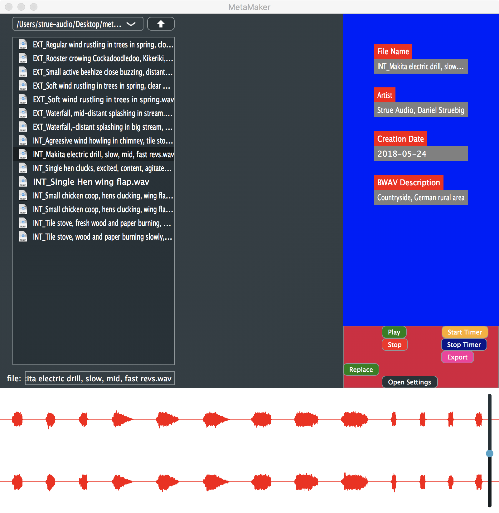

# MetaMaker
Simple audio file management application for editing metadata of audio files, slicing and exporting subsections of audio files etc.

Click on the image to open a little demo video, my reasoning and my progress so far. :)

As of now, my immediate implementation plan is:
* Search functionality
* More attractive UI (goes without saying)
* Drag-And-Drop into DAWs or middlewares like FMOD or Audiokinetic Wwise

